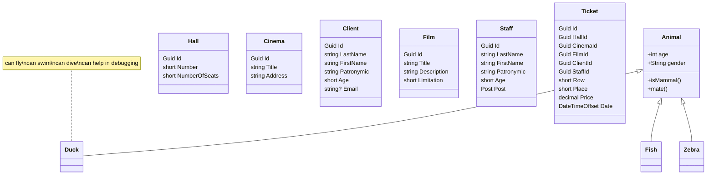

# Автоматизация продажи билетов в кинотеат
# Схема моделей

```mermaid
    classDiagram
    Animal <|-- Duck
    note for Duck "can fly\ncan swim\ncan dive\ncan help in debugging"
    Animal <|-- Fish
    Animal <|-- Zebra
    Animal : +int age
    Animal : +String gender
    Animal: +isMammal()
    Animal: +mate()
    class Hall{
        Guid Id
        short Number
        short NumberOfSeats
    }
    class Cinema{
        Guid Id
        string Title
        string Address
    }
    class Client {
        Guid Id
        string LastName
        string FirstName
        string Patronymic
        short Age
        string? Email
    }
    class Film {
        Guid Id
        string Title
        string Description
        short Limitation
    }

    class Staff {
        Guid Id
        string LastName
        string FirstName
        string Patronymic
        short Age
        Post Post
    }
    class Ticket {
        Guid Id 
        Guid HallId 
        Guid CinemaId
        Guid FilmId
        Guid ClientId
        Guid StaffId
        short Row
        short Place
        decimal Price
        DateTimeOffset Date
    }

```
