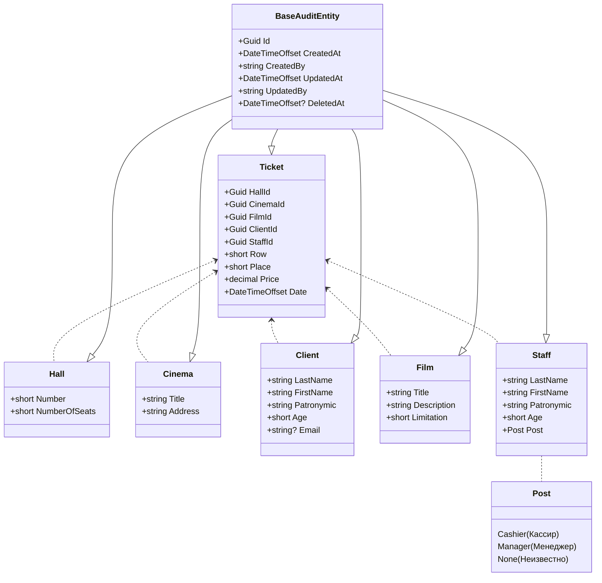

# Автоматизация продажи билетов в кинотеатр
## Схема моделей

```mermaid
    classDiagram
    Ticket <.. Hall
    Ticket <.. Cinema
    Ticket <.. Client
    Ticket <.. Film
    Ticket <.. Staff
    Staff .. Post
    BaseAuditEntity --|> Hall
    BaseAuditEntity --|> Cinema
    BaseAuditEntity --|> Client
    BaseAuditEntity --|> Film
    BaseAuditEntity --|> Ticket
    BaseAuditEntity --|> Staff
    class Hall{
        +short Number
        +short NumberOfSeats
    }
    class Cinema{
        +string Title
        +string Address
    }
    class Client {
        +string LastName
        +string FirstName
        +string Patronymic
        +short Age
        +string? Email
    }
    class Film {
        +string Title
        +string Description
        +short Limitation
    }

    class Staff {
        +string LastName
        +string FirstName
        +string Patronymic
        +short Age
        +Post Post
    }
    class Ticket {
        +Guid HallId 
        +Guid CinemaId
        +Guid FilmId
        +Guid ClientId
        +Guid StaffId
        +short Row
        +short Place
        +decimal Price
        +DateTimeOffset Date
    }
    class Post{
        Cashier(Кассир)
        Manager(Менеджер)
        None(Неизвестно)
    }
    class BaseAuditEntity {
        +Guid Id
        +DateTimeOffset CreatedAt
        +string CreatedBy
        +DateTimeOffset UpdatedAt
        +string UpdatedBy
        +DateTimeOffset? DeletedAt
    }

```
