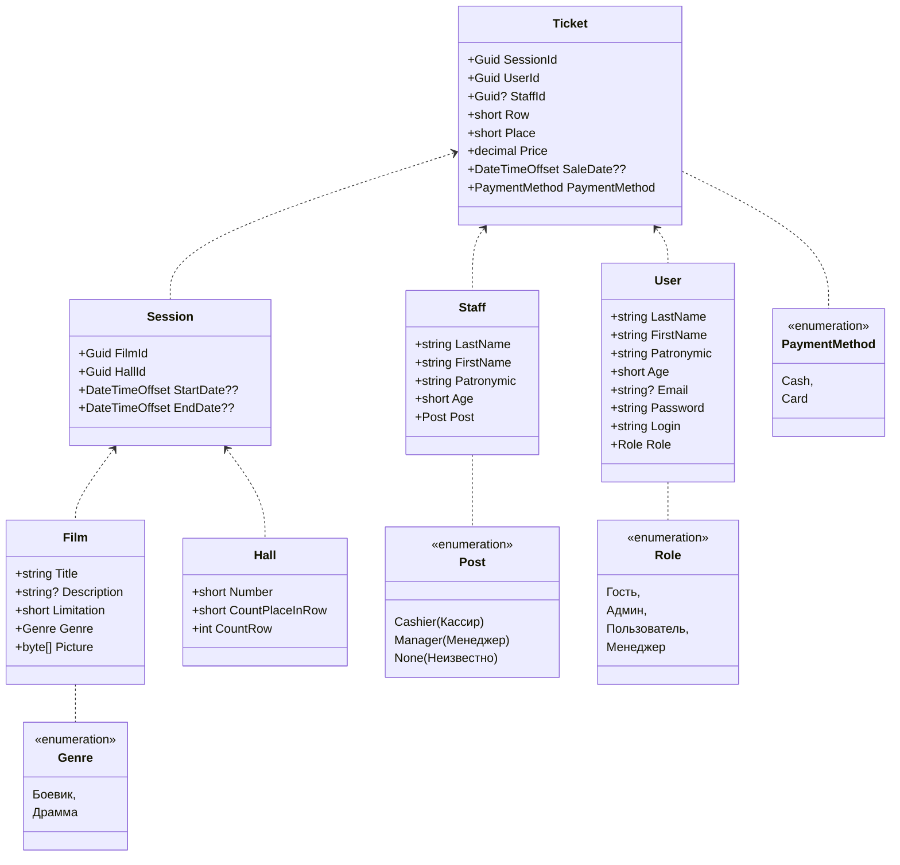

Описание предметной области
---
Автоматизация продажи билетов в кинотеатре.

Автор
---
Кочетков Денис Александрович студент группы ИП 20-3

Схема моделей
---

```mermaid
    classDiagram
    Ticket <.. User
    Ticket <.. Staff
    Ticket <.. Session
    Session <.. Film
    Session <.. Hall
    Staff .. Post
    User .. Role
    Film .. Genre
    Ticket .. PaymentMethod
    class Hall{
        +short Number
        +short CountPlaceInRow
        +int CountRow
    }
    class User {
        +string LastName
        +string FirstName
        +string Patronymic
        +short Age
        +string? Email
        +string Password
        +string Login
        +Role Role
    }
    class Film {
        +string Title
        +string? Description
        +short Limitation
        +Genre Genre
        +byte[] Picture
    }
    class Staff {
        +string LastName
        +string FirstName
        +string Patronymic
        +short Age
        +Post Post
    }
    class Ticket {
        +Guid SessionId   
        +Guid UserId
        +Guid? StaffId
        +short Row
        +short Place
        +decimal Price
        +DateTimeOffset SaleDate??
        +PaymentMethod PaymentMethod       
    }
    class Session {
      +Guid FilmId
      +Guid HallId
      +DateTimeOffset StartDate??
      +DateTimeOffset EndDate??
    }  
    class Post {
        <<enumeration>>
        Cashier(Кассир)
        Manager(Менеджер)
        None(Неизвестно)
    }
 class Role {
        <<enumeration>>
        Гость,
        Админ,
        Пользователь,
        Менеджер
    }
    class Genre {
        <<enumeration>>
        Боевик,
        Драмма
    }
    class PaymentMethod {
        <<enumeration>>
        Cash,
        Card
    }
```
Пример реального бизнес сценария
---

